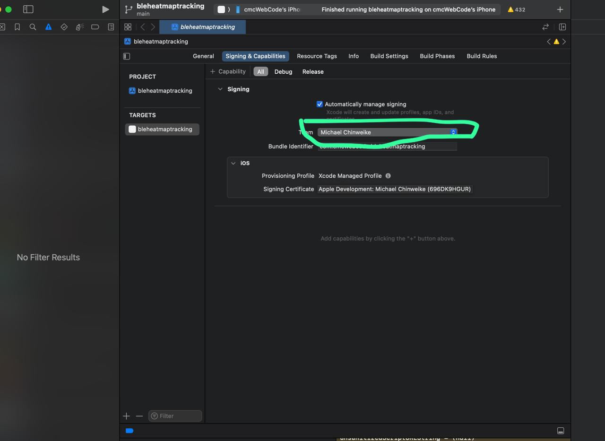
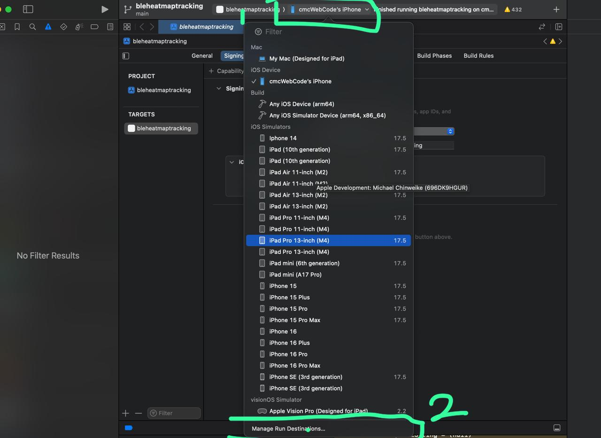
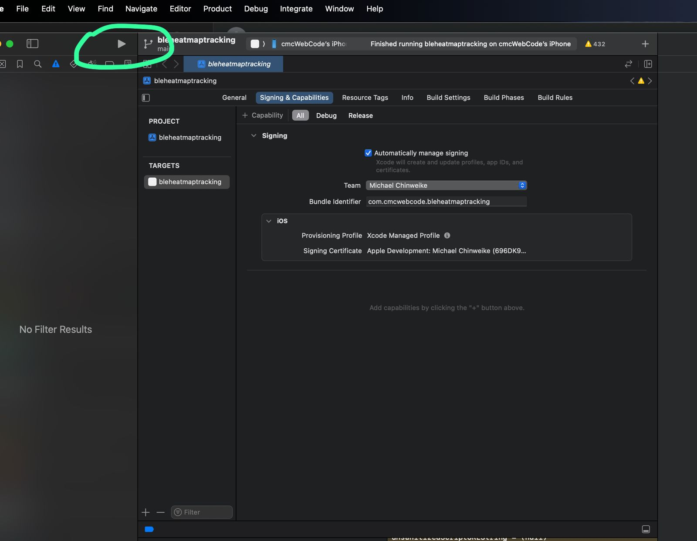

# Bluetooth HeatMap Tracking App.

This is a proof of concept (POC) app that places nearby discovered ble peripherals on a maps and represents those RSSI (received signal strength indicator) as markers using a Deterministic Pseudo-Random Scatter approach in a Polar Coordinate System.


- This Project developed using React Native and Expo libraries.


## Get started

1. Install dependencies

   ```bash
   yarn  install
   ```


**Note:-** 
1. Due to the use of some native libraries such as :

- react-native-ble-manager
- react-native-maps

Expo Go does not support native code.

2. Ensure to add the the google maps API key in the android and ios config section in the `app.json` file.


Example: `app.json`

```json

{
  "expo": {
     ....
    "ios": {
      "config": {
        "googleMapsApiKey": "GOOGLE_MAP_API_KEY"
      }
    },
    "android": {
      ....
      "config": {
        "googleMaps": {
          "apiKey": "GOOGLE_MAP_API_KEY"
        }
      },
    }
  }
}

```


### Android Setup


1. Ensure you have installed Android studio and setup the android emulator using the  android virtual device (AVD).
- [Android emulator](https://docs.expo.dev/workflow/android-studio-emulator/)

2. run the android app 

   ```bash
   yarn  android
   ```

### Ios Setup


1. Ensure to have installed xcode application on your mac book.

2. Run `npx expo prebuild --platform ios`  - to generate the ios folder

3. ⁠Open xcode select the generated ios folder .


4. ⁠⁠Ensure to select a Team on the signing capability.



5. ⁠⁠Connect your iPhone cable.

6. ⁠Click on the simulator/device Tab to add device (your iphone device).




7. ⁠⁠Click on the `start button` to run the build.




### Alternative setup using EAS (Expo application service)

- [development build](https://docs.expo.dev/develop/development-builds/introduction/)


## Learn more

To learn more about developing your project with Expo, look at the following resources:

- [Expo documentation](https://docs.expo.dev/): Learn fundamentals, or go into advanced topics with our [guides](https://docs.expo.dev/guides).
- [Learn Expo tutorial](https://docs.expo.dev/tutorial/introduction/): Follow a step-by-step tutorial where you'll create a project that runs on Android, iOS, and the web.